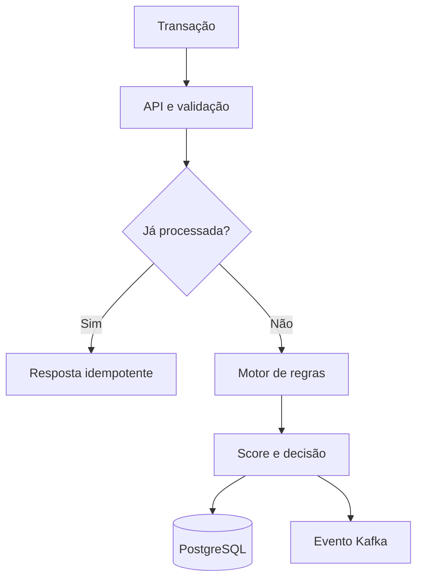

# SentinelFraud Platform

Motor de decisão antifraude em tempo real criado para demonstrar competências de Engenharia de Software Backend Java em um contexto bancário crítico.

## O que o MVP demonstra

- Java 21 e Spring Boot, APIs REST versionadas e validação de contrato.
- Motor extensível de regras usando Strategy e injeção de uma lista ordenada de regras.
- Decisão `APPROVE`, `REVIEW` ou `BLOCK` com score e motivos auditáveis.
- Idempotência por `transactionId`, inclusive proteção contra concorrência no banco.
- PostgreSQL com Flyway, constraints e índices orientados às consultas.
- Evento Kafka após a decisão, permitindo integração assíncrona com alertas e investigação.
- Redis preparado para a próxima fase de velocity checks e listas de bloqueio.
- Métricas Prometheus, health probes, graceful shutdown e Java Virtual Threads.
- Testes unitários, cobertura JaCoCo e pipeline GitHub Actions.
- Container multi-stage executado com usuário sem privilégios.

## Fluxo de decisão



## Regras iniciais

| Código | Regra | Pontuação |
|---|---|---:|
| FR001 | Valor igual ou superior ao limite configurado | 45 |
| FR002 | País diferente de BR | 25 |
| FR003 | Operação entre 00:00 e 04:59 UTC | 20 |

Score menor que 40 aprova; de 40 a 69 envia para revisão; 70 ou mais bloqueia.

## Executar

Pré-requisito: Docker Desktop.

```bash
docker compose up --build -d
docker compose ps
```

- Swagger UI: `http://localhost:8080/swagger-ui.html`
- Health: `http://localhost:8080/actuator/health`
- Prometheus: `http://localhost:8080/actuator/prometheus`
- Exemplos: `http/requests.http`

Para testes locais com Java 21 e Maven 3.9+:

```bash
mvn clean verify
```

Relatório JaCoCo: `target/site/jacoco/index.html`.

## Evolução planejada

1. Velocity rules no Redis: quantidade e soma por cliente, dispositivo e IP em janelas móveis.
2. Device intelligence com adapter externo, circuit breaker, timeout e fallback.
3. Outbox transacional para garantir publicação Kafka sem dual-write.
4. Autenticação OAuth2/JWT, mTLS entre serviços e mascaramento de dados sensíveis.
5. OpenTelemetry com traces, logs correlacionados e SLO de latência p95.
6. Separação em serviços de decisão, feature store, casos e listas; contratos AsyncAPI.
7. AWS: API Gateway, EKS/ECS, MSK/SQS, ElastiCache, RDS/DynamoDB, S3 e IaC Terraform.
8. Shadow mode, feature flags, champion/challenger e modelo de ML versionado.

## Decisões arquiteturais

- O MVP é um monólito modular para reduzir complexidade operacional prematura; as fronteiras internas permitem extração posterior.
- O banco é a fonte de verdade da idempotência. A constraint única trata chamadas concorrentes entre réplicas.
- Regras retornam motivos explicáveis. Em prevenção a fraude, rastreabilidade e contestação importam tanto quanto o score.
- A publicação Kafka direta é conscientemente uma limitação do MVP; Outbox é o próximo passo para consistência forte.

## Autor

Jucelio Farias Coelho — [LinkedIn](https://www.linkedin.com/in/jucelio-desenvolvedor-sistema) · [GitHub](https://github.com/juceliocoelho2022)
