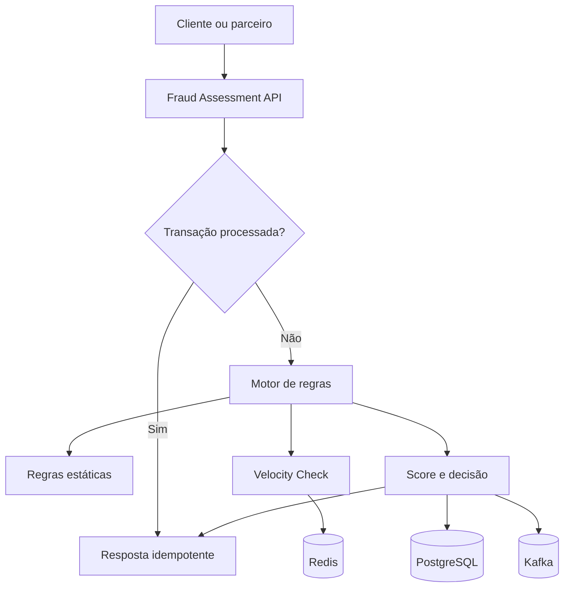

<div align="center">

# 🛡️ SentinelFraud Platform

### Motor de decisão antifraude em tempo real com Java 21, Spring Boot, Kafka e Redis

[](https://openjdk.org/)
[](https://spring.io/projects/spring-boot)
[](https://www.postgresql.org/)
[](https://kafka.apache.org/)
[](https://redis.io/)
[](https://www.docker.com/)
[](https://github.com/juceliocoelho2022/sentinelfraud-platform/actions/workflows/ci.yml)

**API REST · Regras explicáveis · Idempotência · Mensageria · Observabilidade · Testes**

</div>

---

## Visão geral

O **SentinelFraud Platform** é uma solução backend para avaliação de transações financeiras em tempo real. A plataforma recebe uma transação, executa regras de risco, calcula um score auditável e retorna uma decisão: `APPROVE`, `REVIEW` ou `BLOCK`.

O projeto demonstra decisões aplicáveis a sistemas bancários críticos: consistência, rastreabilidade, baixa latência, proteção contra duplicidade, processamento assíncrono e evolução cloud-native.

> **Versão atual: v0.2.0** — motor de regras, PostgreSQL, eventos Kafka e Velocity Check atômico com Redis.

## Destaques técnicos

- API REST versionada e validada com Bean Validation.
- Motor extensível de regras usando Strategy e ordenação explícita.
- Score de risco com motivos explicáveis e auditáveis.
- Idempotência por `transactionId` com proteção contra concorrência.
- Velocity Check por cliente, dispositivo e IP em janela móvel.
- Operação atômica no Redis com Sorted Set e script Lua.
- SHA-256 nos identificadores usados nas chaves do Redis.
- PostgreSQL com versionamento de schema pelo Flyway.
- Eventos de decisão publicados no Apache Kafka.
- Health checks, métricas Prometheus e graceful shutdown.
- Testes com JUnit 5, Mockito, AssertJ e JaCoCo.
- CI com GitHub Actions e ambiente completo via Docker Compose.

## Arquitetura



### Fluxo de decisão

1. A API valida o contrato recebido.
2. O serviço consulta o PostgreSQL pelo `transactionId`.
3. Se a transação já existir, devolve a decisão original.
4. Caso seja nova, as regras são avaliadas em ordem.
5. As pontuações são somadas e limitadas a 100.
6. A decisão e seus motivos são persistidos.
7. Um evento é publicado em `fraud.assessment.completed.v1`.

## Motor de regras

| Código | Regra | Condição | Score |
|:---:|---|---|---:|
| `FR001` | Valor elevado | Valor igual ou superior a R$ 10.000 | 45 |
| `FR002` | País estrangeiro | País diferente de `BR` | 25 |
| `FR003` | Horário incomum | Entre 00:00 e 04:59 UTC | 20 |
| `FR004` | Velocidade por cliente | 5 ou mais transações em 1 minuto | 35 |
| `FR005` | Velocidade por dispositivo | 5 ou mais transações em 1 minuto | 35 |
| `FR006` | Velocidade por IP | 5 ou mais transações em 1 minuto | 35 |

| Score | Decisão | Significado |
|---:|:---:|---|
| 0–39 | `APPROVE` | Risco baixo; transação aprovada |
| 40–69 | `REVIEW` | Risco intermediário; revisão recomendada |
| 70–100 | `BLOCK` | Risco alto; transação bloqueada |

Cada regra implementa `FraudRule`. Novas estratégias podem ser adicionadas sem alterar o fluxo principal.

## Stack

| Área | Tecnologias |
|---|---|
| Backend | Java 21, Spring Boot 3.5, Spring Web |
| Persistência | Spring Data JPA, Hibernate, PostgreSQL 17 |
| Tempo real | Redis 7.4, Sorted Sets, Lua |
| Mensageria | Apache Kafka 3.9 |
| Banco | Flyway |
| Observabilidade | Actuator, Micrometer, Prometheus |
| Qualidade | JUnit 5, Mockito, AssertJ, JaCoCo |
| Infraestrutura | Docker, Docker Compose |
| CI/CD | GitHub Actions |
| Contrato | OpenAPI, Swagger UI |

## Executando o projeto

### Pré-requisitos

- Docker Desktop com Docker Compose.
- Portas `8080`, `5432`, `6379` e `9092` disponíveis.

```bash
docker compose up --build -d
docker compose ps
```

Valide a aplicação:

```bash
curl http://localhost:8080/actuator/health
```

```json
{
  "status": "UP",
  "groups": ["liveness", "readiness"]
}
```

### Recursos locais

| Recurso | URL |
|---|---|
| Swagger UI | http://localhost:8080/swagger-ui.html |
| OpenAPI | http://localhost:8080/v3/api-docs |
| Health | http://localhost:8080/actuator/health |
| Prometheus | http://localhost:8080/actuator/prometheus |

## Exemplo de uso

### Solicitação

```http
POST /api/v1/fraud-assessments
Content-Type: application/json
```

```json
{
  "transactionId": "tx-demo-001",
  "customerId": "customer-42",
  "amount": 15000.00,
  "currency": "BRL",
  "deviceId": "device-a1b2",
  "ipAddress": "203.0.113.15",
  "country": "US",
  "occurredAt": "2026-09-10T02:30:00Z"
}
```

### Resposta

```json
{
  "assessmentId": "4c243b47-088e-4486-a0cc-42370b93547e",
  "transactionId": "tx-demo-001",
  "decision": "BLOCK",
  "riskScore": 90,
  "reasons": ["HIGH_AMOUNT", "FOREIGN_COUNTRY", "UNUSUAL_HOUR_UTC"],
  "assessedAt": "2026-09-10T00:30:26.804Z"
}
```

### PowerShell

```powershell
$body = @{
    transactionId = "tx-demo-001"
    customerId    = "customer-42"
    amount        = 15000.00
    currency      = "BRL"
    deviceId      = "device-a1b2"
    ipAddress     = "203.0.113.15"
    country       = "US"
    occurredAt    = "2026-09-10T02:30:00Z"
} | ConvertTo-Json

Invoke-RestMethod -Method POST `
    -Uri "http://localhost:8080/api/v1/fraud-assessments" `
    -ContentType "application/json" `
    -Body $body
```

Consulte uma decisão:

```http
GET /api/v1/fraud-assessments/tx-demo-001
```

Veja outros cenários em [`http/requests.http`](http/requests.http).

## Velocity Check

O Velocity Check identifica rajadas de transações relacionadas à mesma entidade. Para cliente, dispositivo e IP, o Redis mantém uma janela móvel e executa atomicamente:

1. remoção dos eventos expirados;
2. registro da transação atual;
3. atualização do TTL;
4. contagem dos eventos válidos.

O `transactionId` é o membro do Sorted Set, evitando contagem duplicada. Os identificadores são convertidos em SHA-256 antes de compor as chaves.

| Variável | Padrão | Descrição |
|---|---:|---|
| `VELOCITY_WINDOW` | `PT1M` | Janela em formato ISO-8601 |
| `VELOCITY_THRESHOLD` | `5` | Quantidade que ativa a regra |
| `VELOCITY_SCORE` | `35` | Score adicionado por regra |

## Testes e qualidade

Com Java 21 e Maven 3.9 ou superior:

```bash
mvn clean verify
```

O build executa os testes e exige cobertura mínima de 70% por linhas. O relatório JaCoCo é gerado em:

```text
target/site/jacoco/index.html
```

O GitHub Actions executa a validação a cada `push` e `pull request` para a `main`.

## Estrutura

```text
sentinelfraud-platform/
├── .github/workflows/       # Integração contínua
├── http/                    # Requisições de exemplo
├── src/main/java/br/com/jucelio/sentinelfraud/
│   ├── api/                 # Controllers, contratos e erros
│   ├── config/              # OpenAPI
│   ├── domain/              # Domínio
│   ├── persistence/         # JPA e PostgreSQL
│   ├── rules/               # Regras antifraude
│   ├── service/             # Orquestração
│   └── velocity/            # Contadores Redis
├── src/main/resources/db/   # Migrations Flyway
├── src/test/java/           # Testes automatizados
├── Dockerfile
├── docker-compose.yml
└── pom.xml
```

## Decisões de engenharia

### Monólito modular primeiro

O MVP começa como monólito modular para evitar complexidade operacional prematura. As fronteiras internas permitem extrair serviços quando escala, ownership ou disponibilidade justificarem a separação.

### Idempotência no banco

O PostgreSQL é a fonte de verdade. A consulta inicial otimiza chamadas repetidas e a constraint única protege contra concorrência entre réplicas.

### Fraude explicável

Cada regra retorna score e motivo. A decisão pode ser auditada, analisada e contestada sem depender de uma classificação opaca.

### Estado transitório no Redis

O Redis mantém somente os eventos das janelas de velocidade. TTL evita crescimento indefinido e SHA-256 reduz a exposição dos identificadores.

### Publicação assíncrona

O Kafka desacopla a decisão de alertas, investigação e analytics. A publicação direta é uma limitação conhecida; o Transactional Outbox está planejado para eliminar o risco de dual-write.

## Roadmap cloud-native

- [x] API e motor extensível de regras.
- [x] PostgreSQL, Flyway e idempotência.
- [x] Eventos com Kafka.
- [x] Velocity Check atômico com Redis.
- [ ] Transactional Outbox, retry e Dead Letter Topic.
- [ ] Device Intelligence com timeout, circuit breaker e fallback.
- [ ] OAuth2/JWT, mTLS e gestão de segredos.
- [ ] OpenTelemetry, traces correlacionados e SLO de latência p95.
- [ ] Feature flags, shadow mode e champion/challenger.
- [ ] Modelo de ML versionado e monitoramento de drift.
- [ ] AWS: API Gateway, ECS/EKS, MSK/SQS, ElastiCache, RDS/DynamoDB e S3.
- [ ] Terraform, autoscaling, blue/green deployment e FinOps.

## Limitações conhecidas

- A publicação Kafka ainda não utiliza Transactional Outbox.
- As regras ainda não possuem painel administrativo.
- Autenticação e autorização serão adicionadas antes de uma exposição pública.
- O projeto é demonstrativo e não processa dados financeiros reais.

## Autor

**Jucelio Farias Coelho**  
Desenvolvedor Backend Java | Spring Boot | Microsserviços | Kafka | AWS

- [LinkedIn](https://www.linkedin.com/in/jucelio-desenvolvedor-sistema)
- [GitHub](https://github.com/juceliocoelho2022)

---

<div align="center">

Desenvolvido com foco em engenharia de software, confiabilidade e prevenção a fraudes.

</div>
