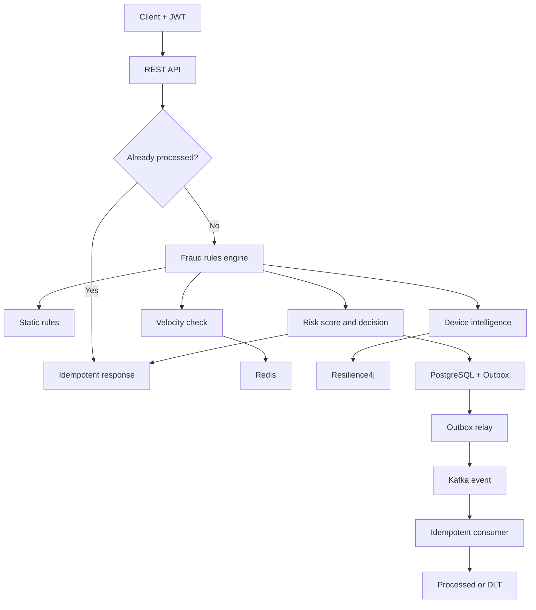

<div align="center">

# 🛡️ SentinelFraud Platform

### Motor de decisão antifraude em tempo real com Java 21, Spring Boot, Kafka e Redis

[](https://openjdk.org/)
[](https://spring.io/projects/spring-boot)
[](https://www.postgresql.org/)
[](https://kafka.apache.org/)
[](https://redis.io/)
[](https://www.docker.com/)
[](https://github.com/juceliocoelho2022/sentinelfraud-platform/actions/workflows/ci.yml)

**API REST · Regras explicáveis · Idempotência · Mensageria · Observabilidade · Testes**

</div>

<p align="center">
  
</p>

---

## Visão geral

O **SentinelFraud Platform** é uma solução backend para avaliação de transações financeiras em tempo real. A plataforma recebe uma transação, executa regras de risco, calcula um score auditável e retorna uma decisão: `APPROVE`, `REVIEW` ou `BLOCK`.

O projeto demonstra decisões aplicáveis a sistemas bancários críticos: consistência, rastreabilidade, baixa latência, proteção contra duplicidade, processamento assíncrono e evolução cloud-native.

> **Versão atual: v0.6.0** — autenticação JWT RS256 e controle de acesso por papéis, além do fluxo resiliente de eventos.

## Destaques técnicos

- API REST versionada e validada com Bean Validation.
- Motor extensível de regras usando Strategy e ordenação explícita.
- Score de risco com motivos explicáveis e auditáveis.
- Idempotência por `transactionId` com proteção contra concorrência.
- Velocity Check por cliente, dispositivo e IP em janela móvel.
- Operação atômica no Redis com Sorted Set e script Lua.
- SHA-256 nos identificadores usados nas chaves do Redis.
- PostgreSQL com versionamento de schema pelo Flyway.
- Eventos de decisão publicados no Apache Kafka.
- Transactional Outbox com claim concorrente, retry exponencial e estado `DEAD`.
- Device Intelligence via HTTP com timeout, retry, circuit breaker e fallback conservador.
- Consumidor Kafka idempotente com retry, DLT persistida e replay operacional.
- API protegida com JWT RS256 e autorização baseada nos papéis `ANALYST` e `ADMIN`.
- Health checks, métricas Prometheus e graceful shutdown.
- Testes com JUnit 5, Mockito, AssertJ e JaCoCo.
- CI com GitHub Actions e ambiente completo via Docker Compose.

## Arquitetura



### Fluxo de decisão

1. A API valida o contrato recebido.
2. O serviço consulta o PostgreSQL pelo `transactionId`.
3. Se a transação já existir, devolve a decisão original.
4. Caso seja nova, as regras são avaliadas em ordem.
5. As pontuações são somadas e limitadas a 100.
6. A decisão e seus motivos são persistidos.
7. O evento é gravado na Outbox dentro da mesma transação.
8. O relay publica o evento em `fraud.assessment.completed.v1`.

## Motor de regras

| Código | Regra | Condição | Score |
|:---:|---|---|---:|
| `FR001` | Valor elevado | Valor igual ou superior a R$ 10.000 | 45 |
| `FR002` | País estrangeiro | País diferente de `BR` | 25 |
| `FR003` | Horário incomum | Entre 00:00 e 04:59 UTC | 20 |
| `FR004` | Velocidade por cliente | 5 ou mais transações em 1 minuto | 35 |
| `FR005` | Velocidade por dispositivo | 5 ou mais transações em 1 minuto | 35 |
| `FR006` | Velocidade por IP | 5 ou mais transações em 1 minuto | 35 |
| `FR007` | Device Intelligence | Dispositivo médio / alto risco | 30 / 60 |

| Score | Decisão | Significado |
|---:|:---:|---|
| 0–39 | `APPROVE` | Risco baixo; transação aprovada |
| 40–69 | `REVIEW` | Risco intermediário; revisão recomendada |
| 70–100 | `BLOCK` | Risco alto; transação bloqueada |

Cada regra implementa `FraudRule`. Novas estratégias podem ser adicionadas sem alterar o fluxo principal.

## Stack

| Área | Tecnologias |
|---|---|
| Backend | Java 21, Spring Boot 3.5, Spring Web |
| Segurança | Spring Security, OAuth2 Resource Server, JWT RS256 e RBAC |
| Persistência | Spring Data JPA, Hibernate, PostgreSQL 17 |
| Tempo real | Redis 7.4, Sorted Sets, Lua |
| Mensageria | Apache Kafka 3.9 |
| Confiabilidade | Resilience4j, Transactional Outbox, retry e `SKIP LOCKED` |
| Banco | Flyway |
| Observabilidade | Actuator, Micrometer, Prometheus |
| Qualidade | JUnit 5, Mockito, AssertJ, JaCoCo |
| Infraestrutura | Docker, Docker Compose |
| CI/CD | GitHub Actions |
| Contrato | OpenAPI, Swagger UI |

## Executando o projeto

### Pré-requisitos

- Docker Desktop com Docker Compose.
- Portas `8080`, `5432`, `6379` e `9092` disponíveis.

```bash
docker compose up --build -d
docker compose ps
```

Valide a aplicação:

```bash
curl http://localhost:8080/actuator/health
```

```json
{
  "status": "UP",
  "groups": ["liveness", "readiness"]
}
```

### Recursos locais

| Recurso | URL |
|---|---|
| Swagger UI | http://localhost:8080/swagger-ui.html |
| OpenAPI | http://localhost:8080/v3/api-docs |
| Health | http://localhost:8080/actuator/health |
| Prometheus | http://localhost:8080/actuator/prometheus (`ADMIN`) |

## Autenticação e autorização

A API opera sem sessão e valida JWTs assinados com RSA. Para facilitar a demonstração local, há dois usuários em memória; as senhas podem e devem ser substituídas por variáveis de ambiente.

| Usuário local | Senha local | Papel | Acesso |
|---|---|---|---|
| `analyst` | `analyst-demo` | `ANALYST` | Criar e consultar avaliações |
| `admin` | `admin-demo` | `ADMIN` | Avaliações, DLT/replay e métricas administrativas |

Gere um token no PowerShell:

```powershell
$credentials = @{
    username = "analyst"
    password = "analyst-demo"
} | ConvertTo-Json

$auth = Invoke-RestMethod -Method POST `
    -Uri "http://localhost:8080/api/v1/auth/token" `
    -ContentType "application/json" `
    -Body $credentials

$token = $auth.accessToken
```

No Swagger UI, clique em **Authorize** e informe somente o token. O prefixo `Bearer` é aplicado automaticamente.

## Exemplo de uso

### Solicitação

```http
POST /api/v1/fraud-assessments
Content-Type: application/json
Authorization: Bearer <token>
```

```json
{
  "transactionId": "tx-demo-001",
  "customerId": "customer-42",
  "amount": 15000.00,
  "currency": "BRL",
  "deviceId": "device-a1b2",
  "ipAddress": "203.0.113.15",
  "country": "US",
  "occurredAt": "2026-09-10T02:30:00Z"
}
```

### Resposta

```json
{
  "assessmentId": "4c243b47-088e-4486-a0cc-42370b93547e",
  "transactionId": "tx-demo-001",
  "decision": "BLOCK",
  "riskScore": 90,
  "reasons": ["HIGH_AMOUNT", "FOREIGN_COUNTRY", "UNUSUAL_HOUR_UTC"],
  "assessedAt": "2026-09-10T00:30:26.804Z"
}
```

### PowerShell

```powershell
$body = @{
    transactionId = "tx-demo-001"
    customerId    = "customer-42"
    amount        = 15000.00
    currency      = "BRL"
    deviceId      = "device-a1b2"
    ipAddress     = "203.0.113.15"
    country       = "US"
    occurredAt    = "2026-09-10T02:30:00Z"
} | ConvertTo-Json

Invoke-RestMethod -Method POST `
    -Uri "http://localhost:8080/api/v1/fraud-assessments" `
    -ContentType "application/json" `
    -Headers @{ Authorization = "Bearer $token" } `
    -Body $body
```

Consulte uma decisão:

```http
GET /api/v1/fraud-assessments/tx-demo-001
```

Veja outros cenários em [`http/requests.http`](http/requests.http).

## Velocity Check

O Velocity Check identifica rajadas de transações relacionadas à mesma entidade. Para cliente, dispositivo e IP, o Redis mantém uma janela móvel e executa atomicamente:

1. remoção dos eventos expirados;
2. registro da transação atual;
3. atualização do TTL;
4. contagem dos eventos válidos.

O `transactionId` é o membro do Sorted Set, evitando contagem duplicada. Os identificadores são convertidos em SHA-256 antes de compor as chaves.

| Variável | Padrão | Descrição |
|---|---:|---|
| `VELOCITY_WINDOW` | `PT1M` | Janela em formato ISO-8601 |
| `VELOCITY_THRESHOLD` | `5` | Quantidade que ativa a regra |
| `VELOCITY_SCORE` | `35` | Score adicionado por regra |

## Transactional Outbox

A decisão e o evento são persistidos na mesma transação PostgreSQL. Isso evita o cenário em que a decisão é salva, mas o Kafka fica indisponível antes da publicação.

O relay processa eventos em lotes e utiliza `FOR UPDATE SKIP LOCKED`, permitindo múltiplas instâncias sem publicar o mesmo registro simultaneamente. Cada tentativa possui:

- estado `PENDING`, `PROCESSING`, `PUBLISHED` ou `DEAD`;
- contador de tentativas;
- timeout de envio;
- backoff exponencial limitado a 60 segundos;
- recuperação de claims abandonados;
- registro do último erro;
- métricas de publicação e falha.

| Variável | Padrão | Descrição |
|---|---:|---|
| `OUTBOX_FIXED_DELAY` | `1000` | Intervalo do relay em milissegundos |
| `OUTBOX_BATCH_SIZE` | `50` | Eventos reclamados por ciclo |
| `OUTBOX_MAX_ATTEMPTS` | `8` | Tentativas antes do estado `DEAD` |
| `OUTBOX_SEND_TIMEOUT` | `PT5S` | Timeout de publicação no Kafka |

## Device Intelligence resiliente

A regra `FR007` consulta um fornecedor simulado antes de concluir o score. A integração usa Resilience4j para impedir que lentidão ou indisponibilidade externa derrube a análise antifraude.

| Prefixo do `deviceId` | Cenário simulado | Resultado |
|---|---|---|
| `device-` | Dispositivo conhecido | Baixo risco, score 0 |
| `review-` | Dispositivo novo | Médio risco, score 30 |
| `risk-` | Root, emulador ou IP divergente | Alto risco, score 60 |
| `slow-` | Fornecedor lento | Timeout e fallback, score 15 |
| `error-` | Fornecedor indisponível | Retry e fallback, score 15 |

O fallback é conservador: mantém a API disponível, marca `DEVICE_INTELLIGENCE_UNAVAILABLE` e adiciona risco moderado para tornar a degradação visível e auditável.

Métricas relevantes ficam disponíveis em `/actuator/prometheus`, incluindo `fraud_device_intelligence_total` e as métricas do circuit breaker.

## Dead Letter Topic e replay

O consumidor processa `fraud.assessment.completed.v1` com idempotência no PostgreSQL. Depois de três tentativas sem sucesso, o `DefaultErrorHandler` e o `DeadLetterPublishingRecoverer` encaminham o evento para `fraud.assessment.completed.v1-dlt`.

A DLT é persistida em `dead_letter_events`, permitindo inspeção e replay controlado. O replay não publica diretamente no broker: ele utiliza a Transactional Outbox e o tópico `fraud.assessment.completed.v1.replay`, mantendo consistência entre a mudança de estado e a solicitação de reprocessamento.

| Operação | Endpoint |
|---|---|
| Listar falhas | `GET /api/v1/admin/dead-letters` |
| Solicitar replay | `POST /api/v1/admin/dead-letters/{id}/replay` |

Para demonstrar o fluxo, use um `transactionId` iniciado por `tx-force-dlt-`. A falha ocorre somente no tópico original; o consumidor de replay processa o mesmo evento com sucesso. Chamadas repetidas ao endpoint não publicam o replay novamente.

## Testes e qualidade

Com Java 21 e Maven 3.9 ou superior:

```bash
mvn clean verify
```

O build executa os testes e exige cobertura mínima de 70% por linhas. O relatório JaCoCo é gerado em:

```text
target/site/jacoco/index.html
```

O GitHub Actions executa a validação a cada `push` e `pull request` para a `main`.

## Estrutura

```text
sentinelfraud-platform/
├── .github/workflows/       # Integração contínua
├── http/                    # Requisições de exemplo
├── src/main/java/br/com/jucelio/sentinelfraud/
│   ├── api/                 # Controllers, contratos e erros
│   ├── config/              # Segurança e OpenAPI
│   ├── device/              # Device Intelligence e resiliência
│   ├── kafka/               # Consumer, idempotência e DLT
│   ├── domain/              # Domínio
│   ├── persistence/         # JPA e PostgreSQL
│   ├── outbox/              # Relay, claim e estados da Outbox
│   ├── rules/               # Regras antifraude
│   ├── service/             # Orquestração
│   └── velocity/            # Contadores Redis
├── src/main/resources/db/   # Migrations Flyway
├── src/test/java/           # Testes automatizados
├── Dockerfile
├── docker-compose.yml
└── pom.xml
```

## Decisões de engenharia

### Monólito modular primeiro

O MVP começa como monólito modular para evitar complexidade operacional prematura. As fronteiras internas permitem extrair serviços quando escala, ownership ou disponibilidade justificarem a separação.

### Idempotência no banco

O PostgreSQL é a fonte de verdade. A consulta inicial otimiza chamadas repetidas e a constraint única protege contra concorrência entre réplicas.

### Fraude explicável

Cada regra retorna score e motivo. A decisão pode ser auditada, analisada e contestada sem depender de uma classificação opaca.

### Estado transitório no Redis

O Redis mantém somente os eventos das janelas de velocidade. TTL evita crescimento indefinido e SHA-256 reduz a exposição dos identificadores.

### Publicação assíncrona confiável

O Kafka desacopla a decisão de alertas, investigação e analytics. O Transactional Outbox elimina o dual-write entre banco e broker, mantendo o evento recuperável até sua publicação.

## Roadmap cloud-native

- [x] API e motor extensível de regras.
- [x] PostgreSQL, Flyway e idempotência.
- [x] Eventos com Kafka.
- [x] Velocity Check atômico com Redis.
- [x] Transactional Outbox com retry e estado `DEAD`.
- [x] Device Intelligence com timeout, retry, circuit breaker e fallback.
- [x] Dead Letter Topic, consumidor idempotente e replay operacional.
- [x] OAuth2 Resource Server, JWT RS256 e RBAC.
- [ ] Testes de integração com WireMock e Testcontainers.
- [ ] IdP externo, mTLS e gestão de segredos.
- [ ] OpenTelemetry, traces correlacionados e SLO de latência p95.
- [ ] Feature flags, shadow mode e champion/challenger.
- [ ] Modelo de ML versionado e monitoramento de drift.
- [ ] AWS: API Gateway, ECS/EKS, MSK/SQS, ElastiCache, RDS/DynamoDB e S3.
- [ ] Terraform, autoscaling, blue/green deployment e FinOps.

## Limitações conhecidas

- A Outbox garante entrega pelo menos uma vez; consumidores devem ser idempotentes.
- As regras ainda não possuem painel administrativo.
- Os usuários em memória e a chave RSA gerada a cada inicialização são adequados somente à demonstração local; produção exige IdP externo e gestão segura de chaves.
- O projeto é demonstrativo e não processa dados financeiros reais.

## Autor

**Jucelio Farias Coelho**  
Desenvolvedor Backend Java | Spring Boot | Microsserviços | Kafka | AWS

- [LinkedIn](https://www.linkedin.com/in/jucelio-desenvolvedor-sistema)
- [GitHub](https://github.com/juceliocoelho2022)

---

<div align="center">

Desenvolvido com foco em engenharia de software, confiabilidade e prevenção a fraudes.

</div>
